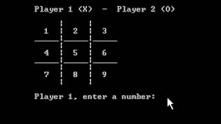

# Tic Tac Toe (XO) Game
XO Game for 2 player 

-The game is to be played between two people (X and O).

-One of the player chooses ‘O’ and the other ‘X’ to mark their respective cells.

-The game starts with one of the players and the game ends when one of the players has one whole { row/ column/ diagonal } filled with his/her respective character (‘O’ or ‘X’).

-If no one wins, then the game is said to be draw and try agian.

